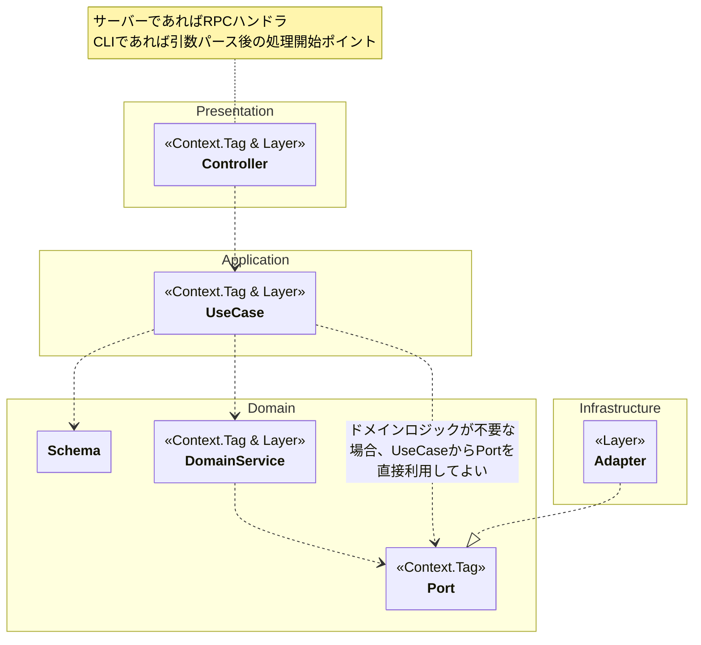

# chroma

## プロジェクト概要

chromaはURLを指定のChromeプロファイルで開くためのツールです。CLIクライアントとサーバーから構成され、UNIXドメインソケットを介して通信します。

miseおよびBunのモノレポ機能を使用してモノレポ構成にしています。

- `packages/client` : CLIクライアントパッケージ (`@chroma/client`)
- `packages/server` : サーバーパッケージ (`@chroma/server`)
- `packages/shared` : 共通パッケージ (`@chroma/shared`)

各パッケージの詳細は `packages/<package>/CLAUDE.md` に記述されています。より深いアーキテクチャ詳細（リクエストライフサイクル・Layer合成・外部コマンド実行等）は `docs/` を参照してください。

## ドキュメント

- `packages/<package>/CLAUDE.md` — パッケージごとの構成・型・依存関係・環境変数（常にコンテキストに読み込まれる）
- `docs/server.md` — サーバー詳細アーキテクチャ（リクエストフロー・Layer合成・外部コマンド実行・ロギング）
- `docs/client.md` — クライアント詳細アーキテクチャ（CLIフロー・プロファイル解決アルゴリズム・RPC接続）

## 技術スタック

- miseを使用します。
- Bunを使用します。
- TypeScriptを使用します。
- Effect-TSを使用します。
  - Effect-TSが提供するモジュールに関して調査する際は <https://effect.website/llms-full.txt> を読み込みます。
- 以下のEffect-TSファーストパーティライブラリを使用します。
  - `@effect/rpc` を使用してRPCを実装します。
  - `@effect/platform` を使用してファイルシステム・OS操作を行います。
- Vitestを使用します。

## 開発コマンド

### パッケージ共通

以下のコマンドは全パッケージで共通です。`<package>` は `client` / `server` / `shared` のいずれかに置き換えてください。

- `mise run //packages/<package>:check -- [files...]` : `<package>` で型チェック・フォーマッター・リンターを実行します。
- `mise run //packages/<package>:fix -- [files...]` : `<package>` でフォーマッター・リンターの自動修正を実行します。
- `mise run //packages/<package>:test -- [vitest-args...]` : `<package>` のテストを実行します。

### 全パッケージのタスクを一括実行する

- `mise run //packages/...:check` : 全パッケージで型チェック・フォーマッター・リンターを実行します。
- `mise run //packages/...:fix` : 全パッケージでフォーマッター・リンターの自動修正を実行します。
- `mise run //packages/...:test` : 全パッケージのテストを実行します。

**注意**: `...` はプレースホルダーではなく、mise tasksのワイルドカード構文としてそのまま入力します。また、全パッケージを対象とする場合は追加の引数を渡すことはできません。

## アーキテクチャ

レイヤー間の依存は内側への一方向のみ許可し、Effect-TS の `Context.Tag` と `Layer` でこれを実現します。

### DIPの実現方法

1. **インターフェイス定義**: 依存先のインターフェイスを `Context.Tag` として定義する。
2. **実装提供**: インターフェイスに対する実装を `Layer` として提供する。
3. **ワイヤリング**: エントリーポイントで `Layer` を合成する。最終的に `Effect.provide` でプログラム全体に渡すことで、すべての `Context.Tag` が解決される。

利用側のコードは `yield*` で依存先の `Context.Tag` を参照するため、実装の詳細を知りません。テスト時は `Layer.succeed` でモック実装を注入します。

### 依存ルール



## プロジェクト規約

### 命名規則

- ディレクトリ・ファイル名には kebab-case を使用します。
- 型エイリアス・インターフェイス・クラス名には PascalCase を使用します。
- 変数・関数・メソッド名には camelCase を使用します。
- 定数名には ALL_UPPER_SNAKE_CASE を使用します。

### テスト

- テストファイルはテスト対象ファイルと同じディレクトリに `*.test.ts` として配置します。
- Effect-TSのコードのテストには `@effect/vitest` を使用します。
- `describe` / `it` の記述は日本語で統一します。
  - `describe`: 最上位にはクラス名・モジュール名等の技術的識別子をそのまま使用します。ネストした `describe` にはメソッド名等の技術的識別子、または日本語のシナリオ説明（例: `〜の場合`）を使用します。
  - `it`: `〜こと` で終わる日本語の文にします。

  ```ts
  describe('CommandExecutor', () => {
    describe('exec', () => {
      describe('コマンドが終了コード0で終了した場合', () => {
        it.effect('成功とみなされること', () => ...)
      })
    })
  })
  ```

- 型の絞り込みが必要な場合、`expect` で値を検証した直後に `@effect/vitest` の `assert` で型ガードします。`assert` 単体ではテスト失敗時のメッセージが不十分なため、必ず `expect` を先行させます。

  ```ts
  expect(Exit.isFailure(result)).toBe(true)
  assert(Exit.isFailure(result))  // 型が絞り込まれ、以降 result.cause にアクセスできる
  ```

### Gitコミット

[Conventional Commits](https://www.conventionalcommits.org/en/v1.0.0/) に従ってコミットメッセージを生成します。

#### 利用可能なタイプ

- `feat:` - 新機能の追加
- `fix:` - バグ修正
- `refactor:` - リファクタリング
- `docs:` - ドキュメントの追加・更新
- `style:` - フォーマット修正 (コードの動作に影響しない変更)
- `perf:` - パフォーマンス改善
- `test:` - テストコードの追加・修正
- `chore:` - メンテナンス作業
  - `chore(deps):` - 依存関係の更新

#### 利用可能なスコープ

- `client` - クライアントパッケージ
- `server` - サーバーパッケージ
- `shared` - 共通パッケージ
- `deps` - 依存関係
- `ci` - CI/CD (`.github/workflows/` 等)
- `claude` - `CLAUDE.md` / `.claude/` 関連

### ドキュメント整合性

コード変更時は対応するドキュメントも更新してください。

- **ファイルの追加・削除** → `packages/<package>/CLAUDE.md` の構成セクション
- **Tag/Layer/ポートの追加・削除・シグネチャ変更** → `packages/<package>/CLAUDE.md` の型・依存関係セクション
- **リクエストフロー・Layer合成の変更** → `docs/<package>.md`
- **環境変数・設定の追加・削除** → `packages/<package>/CLAUDE.md` の環境変数セクション
