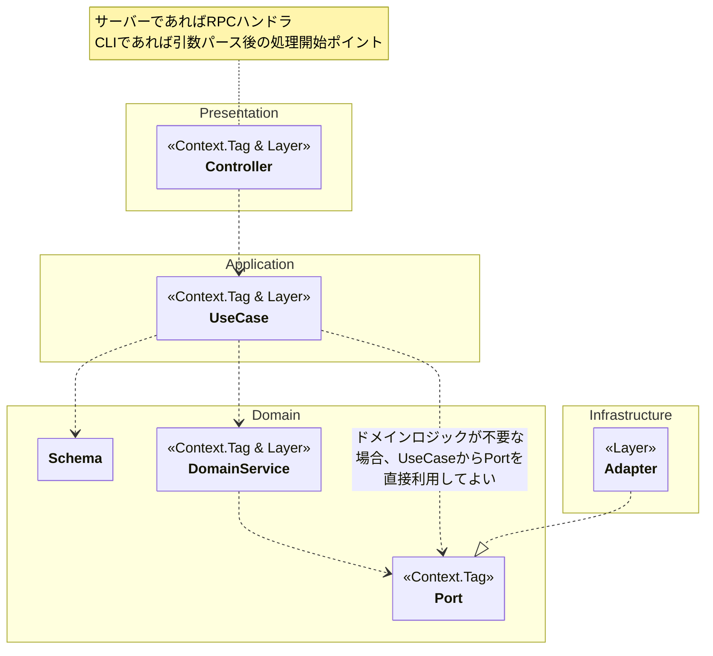

# アーキテクチャ

## DIPの実現方法

レイヤー間の依存は内側への一方向のみ許可し、Effect-TS の `Context.Tag` と `Layer` でこれを実現します。

1. **インターフェイス定義**: 依存先のインターフェイスを `Context.Tag` として定義する。
2. **実装提供**: インターフェイスに対する実装を `Layer` として提供する。
3. **ワイヤリング**: エントリーポイントで `Layer` を合成する。最終的に `Effect.provide` でプログラム全体に渡すことで、すべての `Context.Tag` が解決される。

利用側のコードは `yield*` で依存先の `Context.Tag` を参照するため、実装の詳細を知りません。テスト時は `Layer.succeed` でモック実装を注入します。

## 依存ルール



## 共通ディレクトリ構造

client/server パッケージの `src/` は以下の共通構造に従います（shared は `rpc/` `domain/` `infrastructure/` のみ）:

```
src/
  main.ts              # エントリーポイント
  presentation/        # RPCハンドラ / CLIエントリ
  application/         # ユースケース
  domain/              # スキーマ・ポート・ドメインサービス
  infrastructure/      # ポート実装
```
