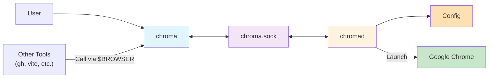

# Project Context

## Purpose

chromaはURLを指定のChromeプロファイルで開くためのツールです。デーモンプロセスとCLIクライアントから構成され、UNIXドメインソケットを介して通信します。



#### `chromad`

- バックグラウンドで動作するデーモンプロセスです。
  - ユーザーによってlaunchdやsystemdでデーモン化されて動くことが前提です。
- UNIXドメインソケットでクライアントからのリクエストを待ち受けてChromeを起動します。

#### `chroma`

- ユーザーが直接実行するCLIツールです。
  - `BROWSER` 環境変数経由で他のツールから呼び出されることも想定します。

## Tech Stack

- Denoを使用します。
  - ビルド時に `deno compile` でシングルバイナリにすることで、実行環境にDenoがなくても動くようにします。
- TypeScriptを使用します。
- サーバー/クライアントアーキテクチャを採用します。
  - サーバー : Hono
    - バリデーションにはZodを使用します。
    - DIにはInversifyJSを使用します。
  - クライアント : Hono RPC クライアント (サーバー実装から生成)
- コマンドライン引数のパースにはCliffyを使用します。
- フォーマッターにはDeno組み込みの `deno fmt` を使用します。
- リンターにはDeno組み込みの `deno lint` を使用します。
- テストにはDeno組み込みの `deno test` を使用します。
- Deno自体のバージョン管理・タスクランナーにはmiseを使用します。
- CI/CDにはGitHub Actionsを使用します。

## Project Structure

```
<project-root>/
├── build/                  # ビルド出力ディレクトリ
├── mise-tasks/             # 複雑なmiseタスクスクリプトを格納するディレクトリ
└── src/                    # ソースコード
    ├── cli/                # ビルドターゲット
    │   ├── chroma.ts       # chroma エントリーポイント
    │   └── chromad.ts      # chromad エントリーポイント
    ├── server.ts           # サーバー
    └── client.ts           # クライアント
```

## Development Commands

- `mise run build` : プロジェクトをビルドし `build/` ディレクトリに出力します。
- `mise run check` : プロジェクト全体の型チェック・フォーマッター・リンターを実行します。
  - 特定のファイルの型チェックを行う場合は `mise run check:type -- <FILES>...` を実行します。
  - 特定のファイルのフォーマットチェックを行う場合は `mise run check:format -- <FILES>...` を実行します。
  - 特定のファイルのリントチェックを行う場合は `mise run check:lint -- <FILES>...` を実行します。
- `mise run fix` : プロジェクト全体のフォーマッター・リンターの自動修正を実行します。
  - 特定のファイルに対して自動修正を行う場合は `mise run fix -- <FILES>...` を実行します。
- `mise run test` : プロジェクト全体のテストを実行します。
  - 特定のファイルのテストを実行する場合は `mise run test -- <FILES>...` を実行します。
- `mise run gha:lint` : GitHub Actions関連ファイルのリントチェックを実行します。

## Project Conventions

### Code Style

- ディレクトリ・ファイル名には kebab-case を使用します。
- 型エイリアス・インターフェイス・クラス名には PascalCase を使用します。
- 変数・関数・メソッド名には camelCase を使用します。
- 定数名には ALL_UPPER_SNAKE_CASE を使用します。

### Architecture Patterns

[Document your architectural decisions and patterns]

TBD

### Testing Strategy

[Explain your testing approach and requirements]

TBD

### Git Workflow

[Describe your branching strategy and commit conventions]

TBD

## Domain Context

[Add domain-specific knowledge that AI assistants need to understand]

TBD

## Important Constraints

[List any technical, business, or regulatory constraints]

TBD

## External Dependencies

[Document key external services, APIs, or systems]

TBD
