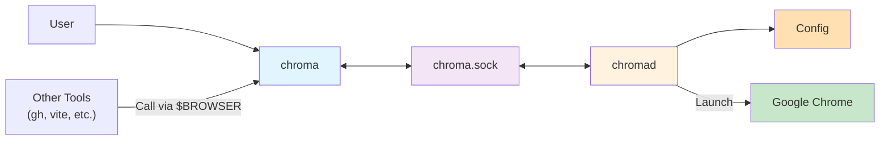

# Project Context

## Purpose

chromaはURLを指定のChromeプロファイルで開くためのツールです。デーモンプロセスとCLIクライアントから構成され、UNIXドメインソケットを介して通信します。



#### `chromad`

- バックグラウンドで動作するデーモンプロセスです。
  - ユーザーによってlaunchdやsystemdでデーモン化されて動くことが前提です。
- UNIXドメインソケットでクライアントからのリクエストを待ち受けてChromeを起動します。

#### `chroma`

- ユーザーが直接実行するCLIツールです。
  - `BROWSER` 環境変数経由で他のツールから呼び出されることも想定します。

## Tech Stack

- Denoを使用します。
  - ビルド時に `deno compile` でシングルバイナリにすることで、実行環境にDenoがなくても動くようにします。
- TypeScriptを使用します。
- サーバー/クライアントアーキテクチャを採用します。
  - サーバー : Hono
    - バリデーションにはZodを使用します。
      - **重要**: Zodは `/mini` サブパスエクスポートを使用します (`@zod/zod/mini`)。
        - これはZod 4で公式にサポートされている機能です ([公式ドキュメント](https://zod.dev/packages/mini))。
        - Tree-shakingが可能で、バンドルサイズを削減できます。
        - `deno.jsonc` では `@zod/zod` のみを定義し、コード内では `@zod/zod/mini` をインポートします。
    - DIにはInversifyJSを使用します。
  - クライアント : Hono RPC クライアント (サーバー実装から生成)
- コマンドライン引数のパースにはCliffyを使用します。
- フォーマッターにはDeno組み込みの `deno fmt` を使用します。
- リンターにはDeno組み込みの `deno lint` を使用します。
- テストにはDeno組み込みの `deno test` を使用します。
- Deno自体のバージョン管理・タスクランナーにはmiseを使用します。
- CI/CDにはGitHub Actionsを使用します。

## Project Structure

```
<project-root>/
├── build/                  # ビルド出力ディレクトリ
├── mise-tasks/             # 複雑なmiseタスクスクリプトを格納するディレクトリ
└── src/                    # ソースコード
    ├── cli/                # ビルドターゲット
    │   ├── chroma.ts       # chroma エントリーポイント
    │   └── chromad.ts      # chromad エントリーポイント
    ├── types/              # プロジェクト全体で使用するZodスキーマや型定義
    ├── server.ts           # サーバー
    └── client.ts           # クライアント
```

## Development Commands

- `mise run build` : プロジェクトをビルドし `build/` ディレクトリに出力します。
- `mise run check` : プロジェクト全体の型チェック・フォーマッター・リンターを実行します。
  - 特定のファイルの型チェックを行う場合は `mise run check:type -- <FILES>...` を実行します。
  - 特定のファイルのフォーマットチェックを行う場合は `mise run check:format -- <FILES>...` を実行します。
  - 特定のファイルのリントチェックを行う場合は `mise run check:lint -- <FILES>...` を実行します。
- `mise run fix` : プロジェクト全体のフォーマッター・リンターの自動修正を実行します。
  - 特定のファイルに対して自動修正を行う場合は `mise run fix -- <FILES>...` を実行します。
- `mise run test` : プロジェクト全体のテストを実行します。
  - 特定のファイルのテストを実行する場合は `mise run test -- <FILES>...` を実行します。
- `mise run gha:lint` : GitHub Actions関連ファイルのリントチェックを実行します。

## Project Conventions

### Specification Style

仕様文書は**振る舞いを自然言語で記述する**ことを原則とします:

- **記述すべき内容**: システムの振る舞い、入力と出力、エラーハンドリング、状態遷移
- **記述すべきでない内容**: 実装の詳細、Zodスキーマ定義、関数シグネチャ、クラス構造
- **例外**: APIコントラクト(エンドポイント、RPCシグネチャ)、設定ファイル構造、CLI構文など外部インターフェースは記述可能

**良い例**:

```markdown
### Requirement: エイリアス解決

システムはプロファイルエイリアスをディレクトリ名に解決しなければならない(SHALL)。

#### Scenario: 定義されたエイリアスを解決

- **GIVEN** 設定ファイルにエイリアス "personal" が "Profile 2" にマッピングされている
- **WHEN** クライアントが "personal" プロファイルをリクエスト
- **THEN** システムは "Profile 2" を返す
```

**悪い例** (実装の詳細を含む):

````markdown
### Requirement: Zodスキーマ定義

`DaemonConfigSchema` は以下のように定義されなければならない:

```typescript
export const DaemonConfigSchema = z.object({...})
```
````

この方針により:

- 仕様と実装の分離を保ち、リファクタリングの自由度を確保
- レビュー時の「仕様との一貫性」指摘が振る舞いの差異に集中
- 仕様文書の可読性と保守性を向上

### Code Style

- ディレクトリ・ファイル名には kebab-case を使用します。
- 型エイリアス・インターフェイス・クラス名には PascalCase を使用します。
- 変数・関数・メソッド名には camelCase を使用します。
  - ただし、Zodスキーマは PascalCase とし `～Schema` のサフィックスを付けます。
- 定数名には ALL_UPPER_SNAKE_CASE を使用します。

### Architecture Patterns

[Document your architectural decisions and patterns]

TBD

### Testing Strategy

- テストには `@std/testing/bdd` を使用してBDDスタイルで記述します。
  - `describe` でテスト対象をグループ化します。
  - `it` で個別のテストケースを記述します。
  - ネストした `describe` を使用して、より詳細な条件やコンテキストを表現します。
- テストファイル名は `*.test.ts` とします。
- アサーションには `@std/assert` を使用します。
- モックには `@std/testing/mock` を使用します。
- テスト後のクリーンアップには `afterEach` を使用します。

**参考**: [src/runtime.test.ts](src/runtime.test.ts) のテストコードがBDDスタイルの記述例となっています。

```typescript
// 例: BDDスタイルのテスト記述
import { assertEquals } from '@std/assert'
import { afterEach, describe, it } from '@std/testing/bdd'
import { restore, stub } from '@std/testing/mock'

describe('関数名やクラス名', () => {
  afterEach(() => {
    restore()
  })

  describe('特定の条件やコンテキスト', () => {
    it('期待される動作の説明', () => {
      // テストコード
      assertEquals(actual, expected)
    })
  })
})
```

### Git Workflow

[Describe your branching strategy and commit conventions]

TBD

## Domain Context

[Add domain-specific knowledge that AI assistants need to understand]

TBD

## Important Constraints

[List any technical, business, or regulatory constraints]

TBD

## External Dependencies

[Document key external services, APIs, or systems]

TBD
